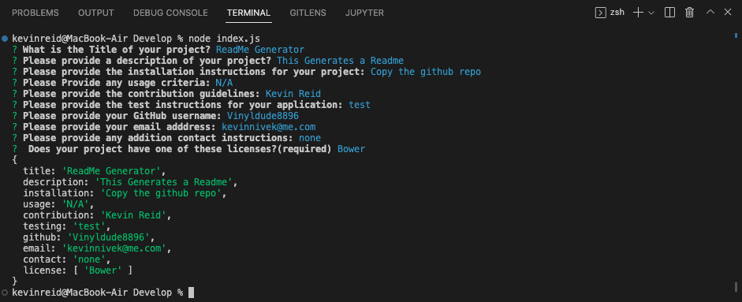
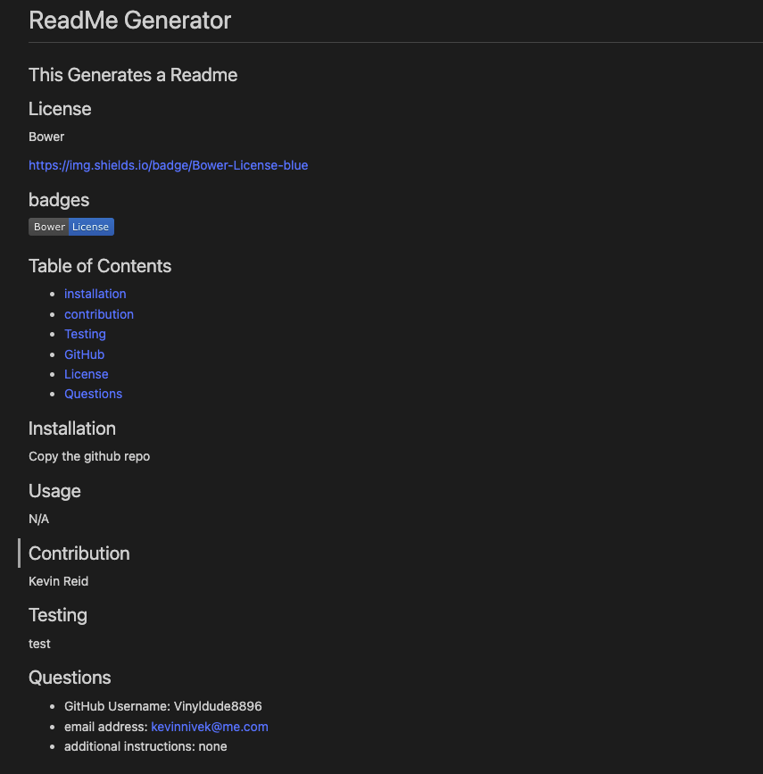

# ReadME.MD Generator

### User Story
As a User, I would like a command line application that will generate a README.md file. When I start this application I should be prompted for information I want in the readme file. After answering all of the prompts I would like a README>md file generated with the information I supplied. 
### Features
This is a command line application that takes input from the user.
The user is prompted for information that will then be used to generate a README.MD file
The Readme file that is generated takes the following information from the user:
    Title of project
    Description of project
    Installation Instructions
    Usage criteria
    Contribution Guidelines
    Test Instructions
    GitHub Username
    email address
    additional contact information
    and licenses used

### badges

## Table of Contents

- [installation](#installation)
- [contribution guidelines](#contribution)
- [Test Instructions](#testing)
- [License](#license)
- [Questions](#questions)

### Installation
1. clone the github repo here : https://github.com/Vinyldude8896/ReadMe-Generator
2. from the terminal use npm index.js

### Contribution Guidelines
Current contributers:
Kevin Reid : https://github.com/Vinyldude8896  
### Testing
To test this app: 
1. Clone the repo here : https://github.com/Vinyldude8896/ReadMe-Generator  
2. From the terminal run npm index.js.  
3. Answer all of the propted questions   
4. In the folder 'generatedfiles' you should see the generated readme.md
### Questions
    email address : kevinnivek@me.com
    - additional instructions 
    I can be contacted by phone as well, but prefer email contact first.

### Video Demo
link to video on how this app works 

https://drive.google.com/file/d/1OHUB3BqVI2gszOZbHd6y1ct1_7vX6X7W/view
### Images 

